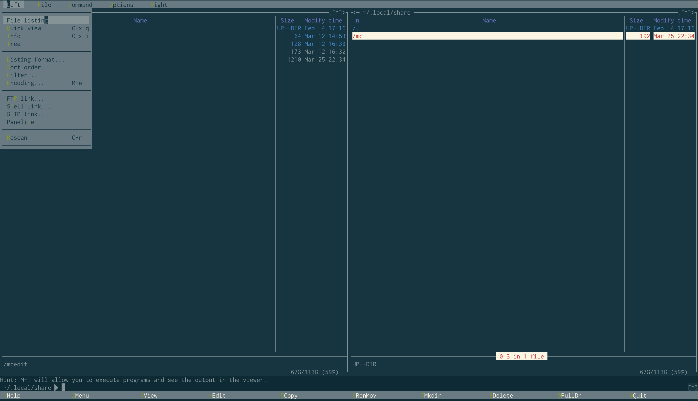

# Midnight Commander Solarized 

These are a skins for [Midnight Commander][1] using the [Solarized palette][2].   
It is designed to be used with terminal emulators that use Solarized palette as   
their [ANSI colors][3].   

It is a fork from nkulikov/mc-solarized-skin and denius/mc-solarized-skin

Some info on skin writing is available on [MC wiki][6].   

# Screenshot

Midnight Commander Solarized


Midnight Commander Solarized II


# Installation and Usage

Note you might need mc > 4.7.5 for this scheme to work 

Clone the repostiry into $HOME/.mc/lib/mc-solarized,   
and define MC_SKIN in .bashrc, .zshrc or .whatnotrc:   

```bash
mkdir -p $HOME/.mc/lib/
git clone https://github.com/sinyagin/mc-solarized-skin.git $HOME/.mc/lib/
echo "export MC_SKIN=$HOME/.mc/lib/mc-solarized/solarized.ini" >> .zshrc
or 
echo "export MC_SKIN=$HOME/.mc/lib/mc-solarized/solarizedII.ini" >> .zshrc
```

If the approach above doesn't work try second one
```bash
mkdir -p $HOME/.local/share/mc/skins
git clone https://github.com/sinyagin/mc-solarized-skin.git $HOME/.local/share/mc/skins
mc
```
You can set the *solarized* or *solarizedII* skin in Options > Appearance.

[1]: https://www.midnight-commander.org                                "Midnight Commander"
[2]: http://ethanschoonover.com/solarized                              "Solarized palette"
[3]: https://github.com/sigurdga/gnome-terminal-colors-solarized       "ANSI colors"
[4]: http://www.midnight-commander.org/nopaste/skin_parser/outdir      "GoTaR"
[5]: https://github.com/seebi/dircolors-solarized                      "dircolors.ansi-universal"
[6]: https://www.midnight-commander.org/wiki/doc/common/skins          "MC wiki"
[7]: https://github.com/iwfmp/midnight-commander/blob/master/install   "MC install script"
